# IOS-Landmarks

Tooth segmentation + landmark (bracket/bonding point) prediction on intra-oral
scans. One shared pipeline engine, several entry points:

| Script                     | Use case                                                                                     |
|-----------------------------|-----------------------------------------------------------------------------------------------|
| `application/monitor.py`   | **Production (automated).** Watches a folder for new patient scans and processes them automatically. This is what the Docker image runs. |
| `infer.py`                 | **Production (on-the-fly).** Manual, ad-hoc segmentation + landmark prediction on a single scan or a folder of scans — the tool to reach for outside the Docker monitor. |
| `main.py`                  | **Development only.** Benchmark harness for the 3DTeethLand dataset layout (sample lists, optional GT collection). Not part of the production path. |
| `segment.py`                | Segmentation only (no landmarks), for debugging/inspecting masks.                             |

All of them are thin wrappers around `application/pipeline.py`'s `LandmarksPredictor`,
which loads both models once and exposes `run_segmentation`, `run_bond_prediction`
and `postprocess`. If you need to change how segmentation + landmark prediction
actually works, that's the one file to edit — everything else (folder-watching in
`monitor.py`, symlink/temp-dir staging in `infer.py`, dataset iteration in `main.py`)
is just orchestration around it.

# Results

## Predicted landmarks

Final per-tooth landmarks (`output_reg/results/landmarks.json`) projected back
onto the input scans. Point colours follow this legend:

<p align="center">
  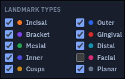
</p>

<table>
  <tr><th></th><th>Lower arch</th><th>Upper arch</th></tr>
  <tr>
    <td align="center"><b>Case&nbsp;1</b></td>
    <td>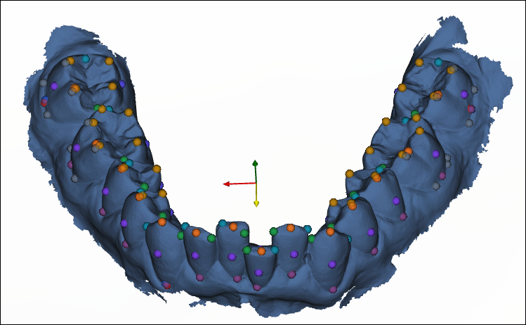</td>
    <td>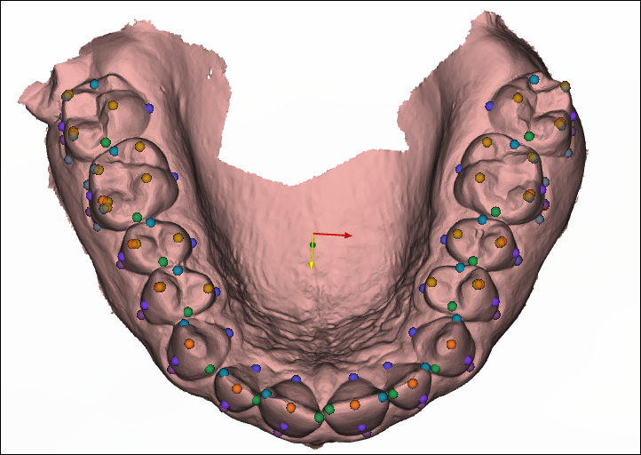</td>
  </tr>
  <tr>
    <td align="center"><b>Case&nbsp;2</b></td>
    <td>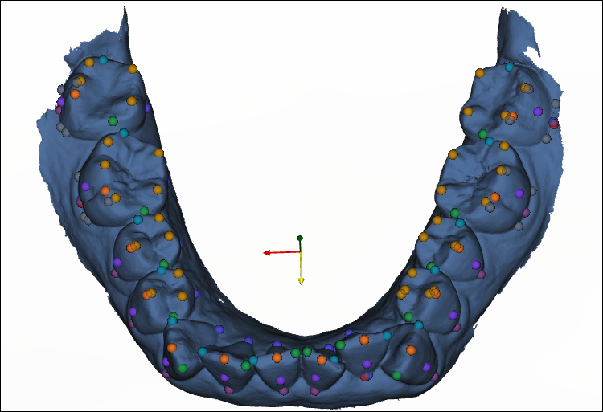</td>
    <td>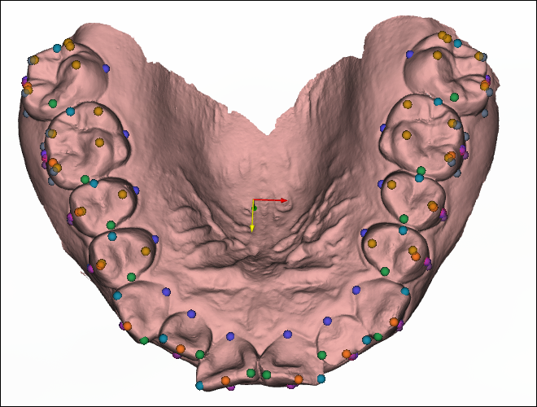</td>
  </tr>
  <tr>
    <td align="center"><b>Case&nbsp;3</b></td>
    <td>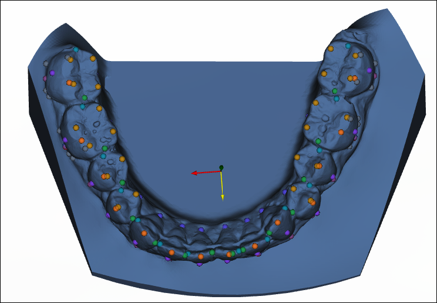</td>
    <td>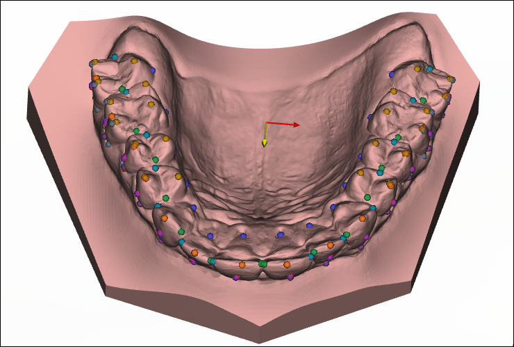</td>
  </tr>
</table>

## Bracket placement in clinical software

These predictions drive a proprietary 3D orthodontic-modelling application
(not part of this repository and not publicly released) that converts each
predicted bonding point + base plane into a positioned bracket. Final bracket
setups for three cases:

<table>
  <tr><th></th><th>Front</th><th>Left</th><th>Right</th></tr>
  <tr>
    <td align="center"><b>Mild&nbsp;1</b></td>
    <td>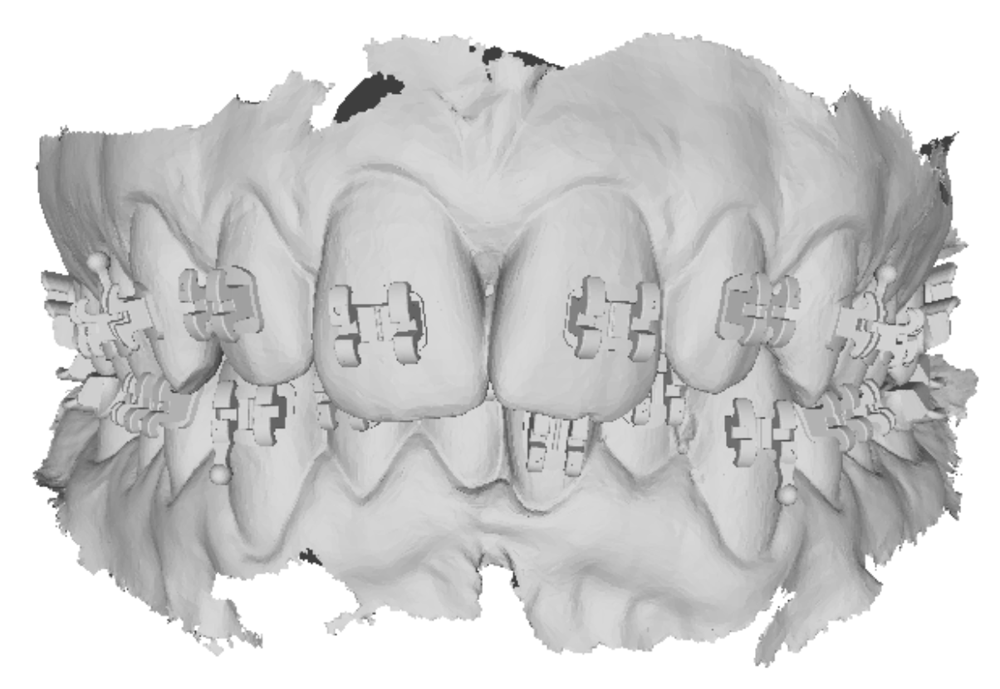</td>
    <td>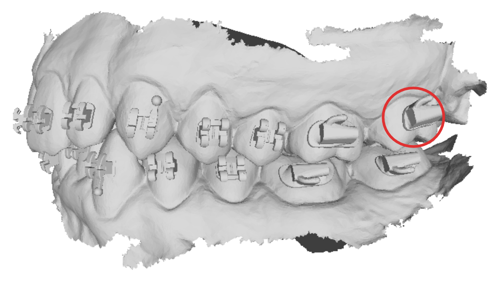</td>
    <td>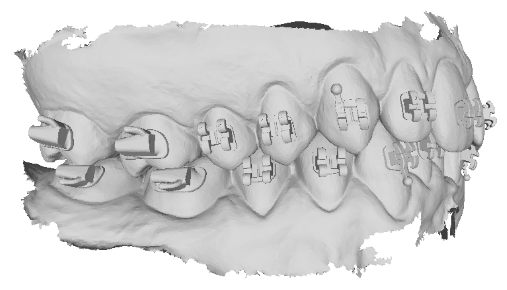</td>
  </tr>
  <tr>
    <td align="center"><b>Mild&nbsp;2</b></td>
    <td>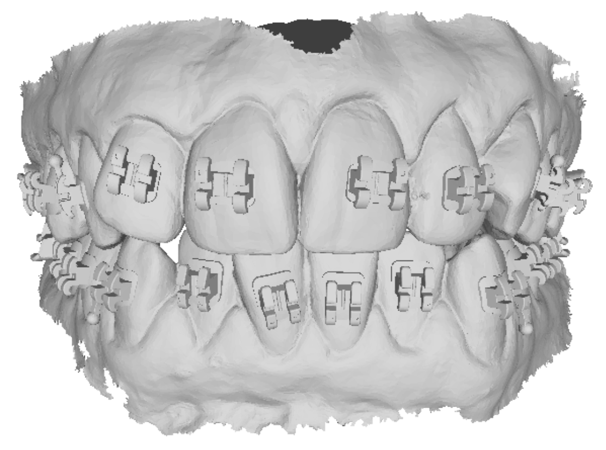</td>
    <td>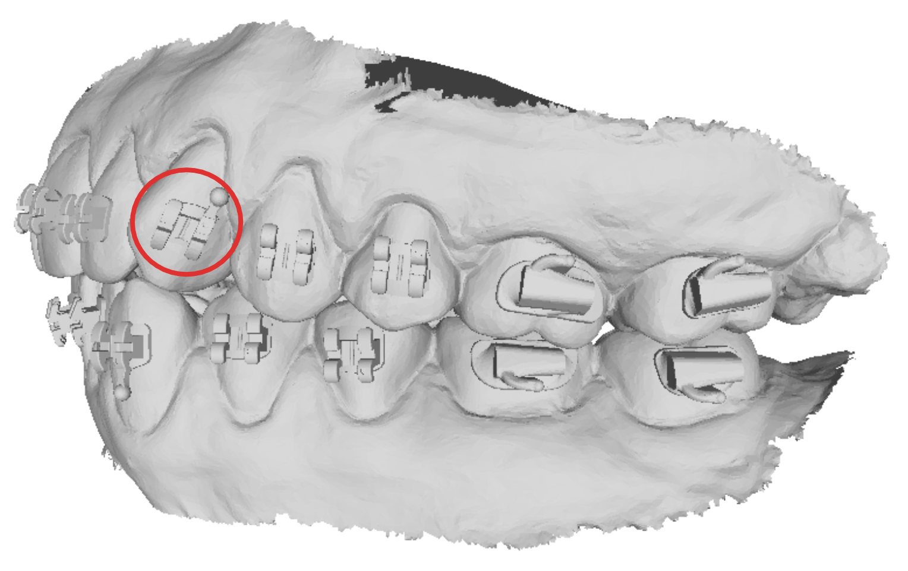</td>
    <td>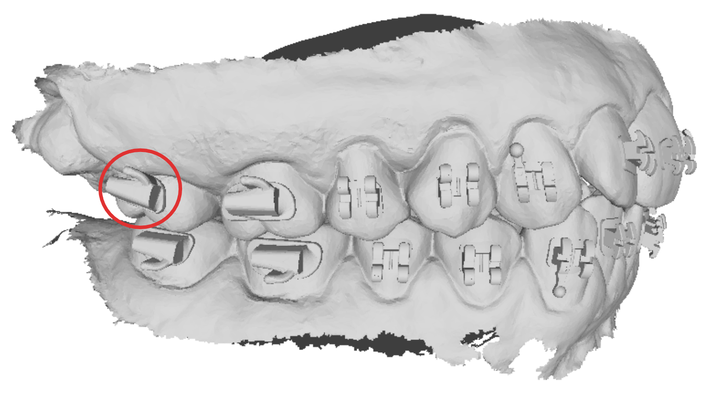</td>
  </tr>
  <tr>
    <td align="center"><b>Moderate&nbsp;1</b></td>
    <td>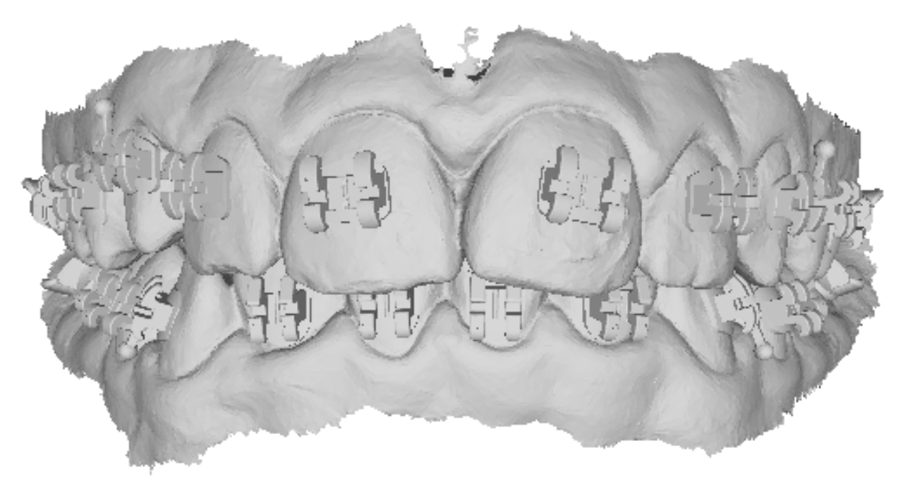</td>
    <td>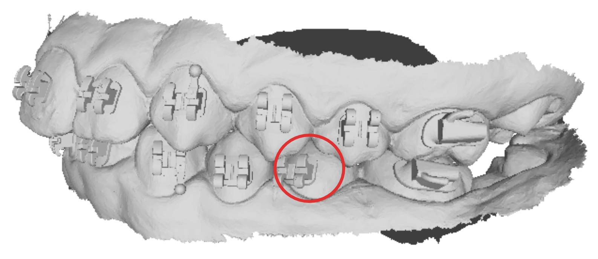</td>
    <td>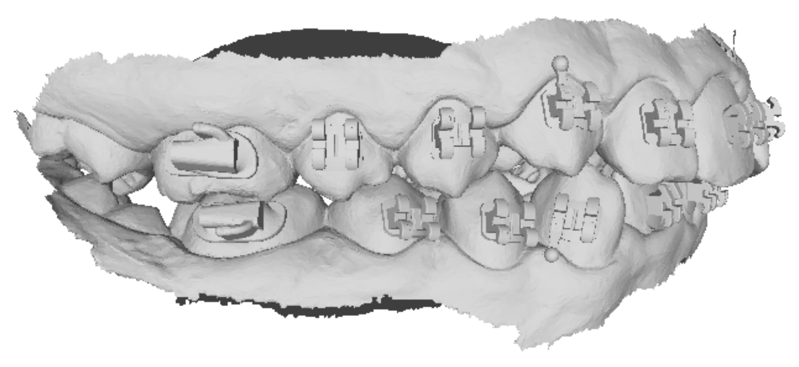</td>
  </tr>
</table>

# Input format

The model expects scans (`.stl`/`.obj`) oriented in the reference frame shown below: the occlusal plane normal aligned with `Z`, the mesio-distal axis aligned with `X`, and the arch rotated so the crowns point along `-Z` (i.e. the raw scan, typically captured with the crowns pointing up, must be rotated 180° around `Y`).


`infer.py` and `main.py` expect scans already in this frame. `application/monitor.py`
additionally accepts **raw**, arbitrarily-oriented scans (see below) and reorients
them itself before running the pipeline.

# Model weights

Pretrained `--seg-weight` and `--bond-weight` checkpoints are available [here](https://drive.google.com/drive/folders/1dQYWACZfZUrg0hWHfTeNg7L60KiqFGL-?usp=sharing).

# Production: the Docker monitor

```bash
docker compose up -d --build
```

`application/monitor.py` polls `--data-root` (mounted at `application/data/` —
see `docker-compose.yml`) for patient folders and processes any new one it finds,
tracking progress in `<data-root>/processing_status.json` and notifying the
[autobonding](https://github.com/AImageLab-zip/AutoBonding) API as each job starts/completes/fails.

### Expected input layout

A patient folder is picked up once it contains **raw scans** under
`<patient_id>/raw_data/`:

- `STEM_lower_<id>.stl`, `STEM_upper_<id>.stl` (case-insensitive `STEM_` prefix)
- `config_<id>.json` (case-insensitive `config_` prefix), containing a
  `scanTransformMatrix` (16 floats, row-major 4×4).

`application/preprocessor.Preprocessor` applies **only** the per-patient
`scanTransformMatrix` and writes `<patient_id>/STEM_<arch>_<id>.stl`. The fixed
standard-orientation rotation — 180°(Y) + 90°(X), plus an extra 180°(Y) for the
upper arch — lives in `preprocessing/production_preprocessing.yaml` (`PREPROCESSING` env var);
it is applied by the segmentation dataset loader before inference and inverted by
`postprocess_predictions` to map predictions back to the `scanTransformMatrix`
frame. The scan is not re-centred — the segmentator normalises coordinates online
and the landmark model works per normalised tooth, so absolute position is
irrelevant.

A patient folder with loose `*.stl` files but no `raw_data/` is marked failed:
all input must arrive through `raw_data/` so the orientation transform above
applies consistently.

Only new/unprocessed `.stl` files trigger work; files already recorded in
`processing_status.json` (processed or failed) are skipped on later polls.

### Output layout (per patient, unchanged from before)

```
<patient_id>/
  output_seg/
    result/<scan>_pred.npy          per-vertex segmentation mask
    teeth/<tooth_key>.stl, .json    per-tooth mesh + normalization params (skipped if --cache)
    <scan>_segmentation_views.png   only with --vis-seg
    remeshed/, remeshed_teeth/      only with --remesh
  output_reg/
    results/
      predictions.json              raw per-tooth heatmap decode
      projected_points.json         predictions projected onto the mesh, pre-rotation
      landmarks.json                final result: predictions rotated back into the
                                     original scan frame, keyed by tooth (e.g. "118_lower_FDI_47")
      projected_points_rotated.json byte-for-byte identical to landmarks.json — kept
                                     as an alias for anything still reading the old name
      landmarks.ply                 only with --save-ply
    plots/patient_<id>_FDI_<fdi>.png   per-tooth prediction plot (generated after completion)
    jaw_plots/<jaw>_rotated_predictions.png   whole-jaw preview (generated after completion)
```

Visualisation (`output_reg/plots/`, `output_reg/jaw_plots/`) is generated
*after* the API is notified, so a slow render never delays the "done" signal.

### Configuring the container

Every optional flag the shared `LandmarksPredictor` engine exposes is available
on the monitor — the same ones `infer.py` takes on the command line
(`--preprocessing`, `--vis-seg`, `--save-ply`, `--landmarks`, `--workers`),
plus `--remesh`/`--cache` which `infer.py` doesn't surface (it always caches,
never remeshes). All of them are settable via environment variables
(`docker-compose.yml` / a `.env` file next to it) so the deployment can be
tuned without rebuilding:

| Env var           | Monitor flag       | Default | Notes |
|--------------------|--------------------|---------|-------|
| `API_TOKEN`        | —                   | —       | Bearer token for the status-notification API. |
| `CHECK_INTERVAL`    | `--check-interval`  | `5`     | Seconds between folder polls. |
| `REMESH`            | `--remesh`          | `false` | Also save a remeshed version of each scan + its per-tooth split. |
| `CACHE`             | `--cache`           | `false` | Keep tooth meshes in memory instead of writing `output_seg/teeth/*`. Faster, but skips those on-disk files — leave `false` to keep the full old on-disk layout. |
| `SAVE_PLY`          | `--save-ply`        | `false` | Also write `landmarks.ply`. |
| `VIS_SEG`           | `--vis-seg`         | `false` | Also render `<scan>_segmentation_views.png`. |
| `WORKERS`           | `--workers`         | `1`     | Thread pool size for CPU/IO-bound steps (disk I/O, per-tooth splitting, heatmap decoding). Does not affect GPU inference. |
| `LANDMARKS`         | `--landmarks`       | (all)   | Space-separated subset, e.g. `LANDMARKS="Bracket Incisal Cusp"`. `Bracket`/`Incisal`/`OuterPoint` are always computed regardless. |
| `PREPROCESSING`     | `--preprocessing`   | `/workspace/preprocessing/production_preprocessing.yaml` | Per-arch scan-orientation transform, applied by the segmentation dataset loader and inverted by `postprocess_predictions` (format: `pointcept/datasets/preprocessing/autobonding/scan_normalizer.py`). The default carries the standard-orientation rotation the segmentator requires — override only with a YAML that still produces that orientation. |

# On-the-fly / manual inference

## infer.py
The on-the-fly production entry point: run this for a one-off scan or a folder
of scans outside the Docker monitor (reprocessing, spot-checks, scans that
don't go through the watched folder). Each scan's filename must contain
`lower` or `upper`. Writes a per-scan segmentation mask (and, optionally, a
landmarks point cloud / segmentation rendering) plus a combined
`landmarks.json` aggregating every scan's predictions.

```bash
python infer.py \
    --input /path/to/scans --output /path/to/predictions \
    --seg-config  application/app_configs/Pt_semseg_teeth3ds_app.py \
    --seg-weight  /path/to/seg_weight.pth \
    --bond-config application/app_configs/Pt_landmarks_app.py \
    --bond-weight /path/to/bond_weight.pth \
    --preprocessing preprocessing/3dteethland_preprocessing.yaml \
    --save-ply
```

Add `--batch` to segment and bond every scan in one pass instead of one scan at a time (faster on large sets), `--vis-seg` to also save a rendering of the segmentation, `--workers N` to parallelize the CPU/IO-bound steps, and `--landmarks ...` to restrict prediction to specific landmark classes. Run `python infer.py --help` for the full list of options.

## main.py (development only)
Not part of the production path — a benchmark harness used to run the model on
the 3DTeethLand dataset layout (`lower`/`upper` subfolders keyed by patient
id), matching predictions against `.txt` sample lists and optionally
collecting ground-truth keypoints.

```bash
python main.py \
    --samples /path/to/lower.txt /path/to/upper.txt \
    --data-folder /path/to/dataset \
    --output-folder /path/to/output \
    --seg-config  application/app_configs/Pt_semseg_teeth3ds_app.py \
    --seg-weight  /path/to/seg_weight.pth \
    --bond-config application/app_configs/Pt_landmarks_app.py \
    --bond-weight /path/to/bond_weight.pth \
    --preprocessing preprocessing/3dteethland_preprocessing.yaml \
    --cache \
    --vis-seg \
    --save-ply
```

A ready-to-use version of this command is available in `run_main_3dteethland.sh`. Run `python main.py --help` for the full list of options.

## segment.py
Segmentation only (no landmark/bond model) — useful for inspecting masks or
debugging the base-plate removal (`--debase`) without paying for the full
pipeline. Run `python segment.py --help` for the full list of options.
